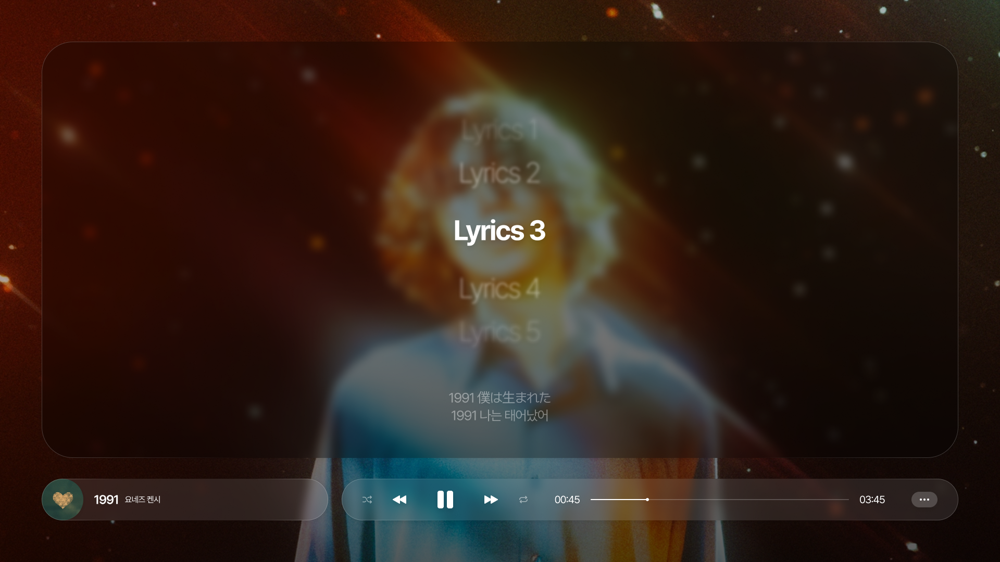

# 가라오케 프롬프트 (Karaoke Prompt)

사용자 입력을 기반으로 가라오케 스타일의 가사를 생성하고 표시하는 웹 애플리케이션입니다. 동기화된 하이라이팅, 발음 및 번역과 함께 가사를 시각화하는 역동적이고 매력적인 방법을 제공합니다.

## 실행 모습


## 동영상 합성 예시



## ✨ 주요 기능

- **가사 입력**: 원문, 발음, 번역문을 함께 쉽게 입력할 수 있습니다.
- **가라오케 애니메이션**: 현재 부르는 라인에 하이라이트가 적용되는 부드러운 가라오케 스타일 애니메이션을 보여줍니다.
- **번역 표시**: 메인 가라오케 가사와 함께 번역된 텍스트를 표시합니다.
- **반응형 UI**: Svelte로 구축되어 데이터가 변경됨에 따라 UI가 실시간으로 업데이트됩니다.

## 🛠️ 기술 스택

- **프레임워크**: [SvelteKit](https://kit.svelte.dev/)
- **언어**: [TypeScript](https://www.typescriptlang.org/)
- **빌드 도구**: [Vite](https://vitejs.dev/)

## 📂 프로젝트 구조

- `src/lib/components`: 재사용 가능한 모든 Svelte 컴포넌트가 위치합니다.
  - `KaraokeArea.svelte`: 가라오케 스타일 애니메이션 표시를 관리합니다.
  - `TranslateArea.svelte`: 번역된 가사를 표시합니다.
  - `LyricsInput.svelte`: 가사 데이터를 입력하기 위한 폼입니다.
  - `LyricsBox.svelte`: 메인 디스플레이 영역을 총괄하는 컨테이너 컴포넌트입니다.
- `src/lib/stores`: 전역 상태 관리를 위한 Svelte 스토어 (`lyricsStore` 등)가 위치합니다.
- `src/lib/types`: `LyricsStructure`와 같은 데이터 구조를 위한 TypeScript 타입 정의가 위치합니다.
- `src/routes`: 애플리케이션의 메인 페이지들이 위치합니다.

## 🚀 시작하기

### 사전 준비

- [Node.js](https://nodejs.org/) (v18 이상 권장)
- `npm`, `pnpm`, 또는 `yarn`

### 개발 서버 실행

프로젝트를 복제하고 `npm install` (또는 `pnpm install` 또는 `yarn`)로 종속성을 설치한 후, 개발 서버를 시작하세요:

```bash
npm run dev

# 또는 서버를 시작하고 새 브라우저 탭에서 앱을 엽니다
npm run dev -- --open
```

### 프로덕션 빌드

앱의 프로덕션 버전을 생성하려면:

```bash
npm run build
```

`npm run preview` 명령어로 프로덕션 빌드를 미리 볼 수 있습니다.

> 앱을 배포하려면 대상 환경에 맞는 [어댑터](https://kit.svelte.dev/docs/adapters)를 설치해야 할 수 있습니다.
